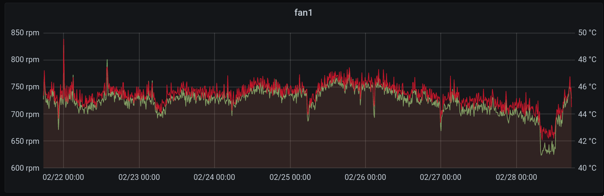

<h1 align="center">
  
  <br>
  fan2go
  <br>
</h1>

<h4 align="center">A daemon to control the fans of your computer.</h4>

<div align="center">

[]()
[](https://github.com/markusressel/fan2go/releases)
[](/LICENSE)

</div>

<p align="center"></p>

# Features

* [x] Intuitive YAML based configuration
* [x] Massive range of supported devices
  * [x] lm-sensors (hwmon) based sensors and fans
  * [x] File based fan/sensor for control/measurement of custom devices
  * [x] Command based fan/sensor
* [x] Per fan user-defined speed curves
* [x] Fully customizable and composable curve definitions
* [x] Works after resume from suspend
* [x] **Stable** device paths after reboot
* [x] Automatic analysis of fan properties, like:
  * [x] RPM curve
  * [x] minimum and maximum PWM
* [x] Error notifications
* [x] Prometheus exporter
* [x] (optional) REST Api

# How to use

fan2go relies on [lm-sensors](https://github.com/lm-sensors/lm-sensors) to get both temperature and RPM sensor readings,
as well as PWM controls, so you will have
to [set it up first](https://wiki.archlinux.org/index.php/Lm_sensors#Installation).

## Installation

### Arch Linux 

```shell
yay -S fan2go-git
```

<details>
<summary>Community Maintained Packages</summary>

### Nix OS 

- Nix with [Flakes](https://nixos.wiki/wiki/Flakes):

```shell
nix profile install nixpkgs#fan2go
```

- Nix stable:

```shell
nix-env -f '<nixpkgs>' -iA fan2go
```

</details>

### Manual

Download the latest release from GitHub:

```shell
# Install dependencies
sudo pacman -S libnotify

curl -L -o fan2go https://github.com/markusressel/fan2go/releases/latest/download/fan2go-linux-amd64
chmod +x fan2go
sudo cp ./fan2go /usr/bin/fan2go
fan2go -h
```

Or compile yourself:

```shell
git clone https://github.com/markusressel/fan2go.git
cd fan2go
make build
sudo cp ./bin/fan2go /usr/bin/fan2go
sudo chmod ug+x /usr/bin/fan2go
```

## Configuration

Then configure fan2go by creating a YAML configuration file in **one** of the following locations:

* `/etc/fan2go/fan2go.yaml` (recommended)
* `/root/.fan2go/fan2go.yaml`
* `./fan2go.yaml`

```shell
sudo mkdir /etc/fan2go
sudo nano /etc/fan2go/fan2go.yaml
```

The most important configuration options you need to define are the `fans:`, `sensors:` and `curves:` sections.

### Fans

Under `fans:` you need to define a list of fan devices that you want to control using fan2go. To detect fans on your
system run `fan2go detect`, which will print a list of devices exposed by the hwmon filesystem backend:

```shell
> fan2go detect
nct6798
 Fans     Index  Channel  Label        RPM   PWM  Auto
          1      1        hwmon4/fan1  0     153  false
          2      2        hwmon4/fan2  1223  104  false
          3      3        hwmon4/fan3  677   107  false
 Sensors   Index   Label    Value
           1       SYSTIN   41000
           2       CPUTIN   64000

amdgpu-pci-0031
 Fans     Index  Channel  Label        RPM   PWM  Auto
          1      1        hwmon8/fan1  561   43   false
 Sensors   Index   Label      Value
           1       edge       58000
           2       junction   61000
           3       mem        56000
```

The fan index is based on device enumeration and is not stable for a given fan if hardware configuration changes.
The Linux kernel hwmon channel is a better identifier for configuration as it is largely based on the fan headers
in use.

Fan RPM, PWM, and temperature sensors are independent and Linux does not associate them automatically. A given PWM
may control more than one fan, and a fan may not be under the control of a PWM. By default, fan2go guesses and sets
the pwm channel number for a given fan to the fan's RPM sensor channel. You can override this in the config.

#### HwMon

To use detected devices in your configuration, use the `hwmon` fan type:

```yaml
# A list of fans to control
fans:
  # A user defined ID.
  # Used for logging only
  - id: cpu
    # The type of fan configuration, one of: hwmon | file
    hwmon:
      # The platform of the controller which is
      # connected to this fan (see sensor.platform below)
      platform: nct6798
      # The channel of this fan's RPM sensor as displayed by `fan2go detect`
      rpmChannel: 1
      # The pwm channel that controls this fan; fan2go defaults to same channel number as fan RPM
      pwmChannel: 1
    # Indicates whether this fan should never stop rotating, regardless of
    # how low the curve value is
    neverStop: true
    # The curve ID that should be used to determine the
    # speed of this fan
    curve: cpu_curve
```

#### File

```yaml
fans:
  - id: file_fan
    file:
      path: /tmp/file_fan
```

```shell
> cat /tmp/file_fan
255
```

#### CMD

Please also make sure to read the section about
[considerations for using the cmd sensor/fan](#using-external-commands-for-sensorsfans).

```yaml
fans:
  - id: cmd_fan
    cmd:
      # (optional) Command to apply a new PWM value (0..255)
      #  use "%pwm%" to specify where the target pwm value should be used withing the arguments
      setPwm:
        exec: /usr/bin/some-program
        args: [ "--set", "%pwm%" ]
      # (optional) Command to retrieve the current PWM value (0..255)
      getPwm:
        exec: /usr/bin/nvidia-settings
        args: [ "-a", "someargument" ]
      # (optional) Command to retrieve the current RPM value
      getRpm:
        exec: /usr/bin/nvidia-settings
        args: [ "-a", "someargument" ]
```

#### Advanced Options

If the automatic fan curve analysis doesn't provide a good enough estimation
for how the fan behaves, you can use the following configuration options (per fan definition)
to correct it:

```yaml
fans:
  - id: ...
    ...
    # (Optional) Override for the lowest PWM value at which the
    # fan is able to maintain rotation if it was spinning previously.
    minPwm: 30
    # (Optional) Override for the lowest PWM value at which the
    # fan will still be able to start rotating.
    # Note: Settings this to a value that is too small
    #       may damage your fans. Use at your own risk!
    startPwm: 30
    # (Optional) Override for the highest PWM value which still yields
    # an increased rotational speed compared to lower values.
    # Note: you can also use this to limit the max speed of a fan.
    maxPwm: 255
    # (Optional) Override for the PWM map used internally by fan2go for
    # mapping the "normal" 0-255 value range to values supported by this fan.
    # This can be used to compensate for a very limited set of supported values
    # (f.ex. off, low, high). If not set manually, the map will be computed
    # automatically by fan2go during fan initialization.
    pwmMap:
      0: 0
      64: 128
      192: 255
```

### Sensors

Under `sensors:` you need to define a list of temperature sensor devices that you want to monitor and use to adjust
fanspeeds. Like with fans, you can find usable devices using `fan2go detect`.

#### HwMon

```yaml
# A list of sensors to monitor
sensors:
  # A user defined ID, which is used to reference
  # a sensor in a curve configuration (see below)
  - id: cpu_package
    # The type of sensor configuration, one of: hwmon | file | cmd
    hwmon:
      # A regex matching a controller platform displayed by `fan2go detect`, f.ex.:
      # "coretemp", "it8620", "corsaircpro-*" etc.
      platform: coretemp
      # The index of this sensor as displayed by `fan2go detect`
      index: 1
```

#### File

```yaml
sensors:
  - id: file_sensor
    file:
      # Path to the file containing sensor values
      path: /tmp/file_sensor
```

The file contains a value in milli-units, like f.ex. milli-degrees.

```bash
> cat /tmp/file_sensor
10000
```

#### CMD

Please also make sure to read the section about
[considerations for using the cmd sensor/fan](#using-external-commands-for-sensorsfans).

Just like the `file` sensor, the command must output the sensor value in milli-units,
like f.ex. milli-degrees.

```yaml
sensors:
  - id: cmd_fan
    cmd:
      # Path to the executable to run to retrieve the current sensor value
      exec: /usr/bin/bash
      # (optional) arguments to pass to the executable
      args: [ '/home/markus/myscript.sh' ]
```

### Curves

Under `curves:` you need to define a list of fan speed curves, which represent the speed of a fan based on one or more
temperature sensors.

#### Linear

To create a simple, linear speed curve, use a curve of type `linear`.

This curve type can be used with a min/max sensor value, where the min temp will result in a curve value of `0` and the
max temp will result in a curve value of `255`:

```yaml
curves:
  - id: cpu_curve
    # The type of the curve, one of: linear | function
    linear:
      # The sensor ID to use as a temperature input
      sensor: cpu_package
      # Sensor input value at which the curve is at minimum speed
      min: 40
      # Sensor input value at which the curve is at maximum speed
      max: 80
```

You can also define the curve in multiple, linear sections using the `steps` parameter:

```yaml
curves:
  - id: cpu_curve
    # The type of the curve
    linear:
      # The sensor ID to use as a temperature input
      sensor: cpu_package
      # Steps to define a section-wise defined speed curve function.
      steps:
        # Sensor value -> Speed (in pwm)
        - 40: 0
        - 50: 50
        - 80: 255
```

#### PID

If you want to get your hands dirty and use a PID based curve, you can use `pid`:

```yaml
curves:
  - id: pid_curve
    pid:
      sensor: cpu_package
      setPoint: 60
      p: -0.05
      i: -0.005
      d: -0.005
```

Unlike the other curve types, this one does not use the average of the sensor data
to calculate its value, which allows you to create a completely custom behaviour.
Keep in mind though that the fan controller is also PID based and will also affect
how the curve is applied to the fan.

#### Function

To create more complex curves you can combine exising curves using a curve of type `function`:

```yaml
curves:
  - id: case_avg_curve
    function:
      # Type of aggregation function to use, one of: minimum | maximum | average | delta | sum | difference
      type: average
      # A list of curve IDs to use
      curves:
        - cpu_curve
        - mainboard_curve
        - ssd_curve
```

### Example

An example configuration file including more detailed documentation can be found in [fan2go.yaml](/fan2go.yaml).

### Verify your Configuration

To check whether your configuration is correct before actually running fan2go you can use:

```shell
> sudo fan2go config validate
 INFO  Using configuration file at: /etc/fan2go/fan2go.yaml
 SUCCESS  Config looks good! :)
```

or to validate a specific config file:

```shell
> fan2go -c "./my_config.yaml" config validate
 INFO  Using configuration file at: ./my_config.yaml
 WARNING  Unused curve configuration: m2_first_ssd_curve
  ERROR   Validation failed: Curve m2_ssd_curve: no curve definition with id 'm2_first_ssd_curve123' found
```

## Using external commands for sensors/fans

fan2go supports using external executables for use as both sensor input, as well as fan output (and rpm input). There
are some considerations you should take into account before using this feature though:

### Security

Since fan2go requires root permissions to interact with lm-sensors, executables run by fan2go are also executed as root.
To prevent some malicious actor from taking advantage of this fan2go will only allow the execution of files that only
allow the root user (UID 0) to modify the file.

### Side effects

Running external commands repeatedly through fan2go can have unintended side effects. F.ex., on a laptop using hybrid
graphics, running `nvidia-settings` can cause the dedicated GPU to wake up, resulting in substantial increase in power
consumption while on battery. Also, fan2go expects to be able to update sensor values with a minimal delay, so using a
long running script or some network call with a long timeout could also cause problems. With great power comes great
responsibility, always remember that :)

## Run

After successfully verifying your configuration you can launch fan2go from the CLI and make sure the initial setup is
working as expected. Assuming you put your configuration file in `/etc/fan2go/fan2go.yaml` run:

```shell
> fan2go help                                                                                                                                                                              2 (0.032s) < 22:43:49
fan2go is a simple daemon that controls the fans
on your computer based on temperature sensors.

Usage:
  fan2go [flags]
  fan2go [command]

Available Commands:
  completion  Generate the autocompletion script for the specified shell
  config      Configuration related commands
  curve       Curve related commands
  detect      Detect fans and sensors
  fan         Fan related commands
  help        Help about any command
  sensor      Sensor related commands
  version     Print the version number of fan2go

Flags:
  -c, --config string   config file (default is $HOME/.fan2go.yaml)
  -h, --help            help for fan2go
      --no-color        Disable all terminal output coloration
      --no-style        Disable all terminal output styling
  -v, --verbose         More verbose output

Use "fan2go [command] --help" for more information about a command.

> sudo fan2go
```

Alternatively you can specify the path to your configuration file like this:

```shell
> sudo fan2go -c /home/markus/my_fan2go_config.yaml
```

## As a Service

### Systemd

When installing fan2go using a package, it comes with a [systemd unit file](./fan2go.service). To enable it simply run:

```shell
sudo systemctl daemon-reload
sudo systemctl enable --now fan2go
# follow logs
journalctl -u fan2go -f
```

## CLI Commands

Although fan2go is a fan controller daemon at heart, it also provides some handy cli commands to interact with the
devices that you have specified within your config.

### Fans interaction

```shell
> fan2go fan --id cpu speed 100

> fan2go fan --id cpu speed
255

> fan2go fan --id cpu rpm
546
```

### Sensors

```shell
> fan2go sensor --id cpu_package
46000
```

### Print fan curve data

For each newly configured fan **fan2go** measures its fan curve and stores it in a db for future reference. You can take
a look at this measurement using the following command:

```shell
> sudo fan2go curve
nct6798 -> pwm1

 Start PWM   0
 Max PWM     255

No fan curve data yet...


nct6798 -> pwm2

 Start PWM   0
 Max PWM     194

 1994 ┤                                                                          ╭────────────────────────
 1900 ┤                                                                       ╭──╯
 1805 ┤                                                                  ╭────╯
 1711 ┤                                                             ╭────╯
 1616 ┤                                                        ╭────╯
 1522 ┤                                                    ╭───╯
 1427 ┤                                               ╭────╯
 1333 ┤                                          ╭────╯
 1238 ┤                                    ╭─────╯
 1144 ┤                               ╭────╯
 1049 ┤                         ╭─────╯
  955 ┤                   ╭─────╯
  860 ┤             ╭─────╯
  766 ┤       ╭─────╯
  671 ┤ ╭─────╯
  577 ┼─╯
                                                    RPM / PWM
```

## Statistics

fan2go has a prometheus exporter built in, which you can use to extract data over time. Simply enable it in your
configuration and you are good to go:

```yaml
statistics:
  # Whether to enable the prometheus exporter or not
  enabled: true
  # The port to expose the exporter on
  port: 9000
```

You can then see the metics on [http://localhost:9000/metrics](http://localhost:9000/metrics) while the fan2go daemon is
running.

## API

fan2go comes with a built-in REST Api. This API can be used by third party tools to display (and in the future possibly
modify) the state of fans, sensors and curves within fan2go.

```yaml
api:
  # Whether to enable the API or not
  enabled: false
  # The host to listen for connections
  host: localhost
  # The port to listen for connections
  port: 9001
```

### Endpoints

Currently, this API is read-only and only provides REST endpoints. If there is demand for it, this might be expanded to
also support realtime
communication via websockets.

#### Fans

| Endpoint    | Type | Description                                       |
|-------------|------|---------------------------------------------------|
| `/fan`      | GET  | Returns a list of all currently configured fans   |
| `/fan/<id>` | GET  | Returns the fan with the given `id`, if it exists |

#### Sensors

| Endpoint       | Type | Description                                          |
|----------------|------|------------------------------------------------------|
| `/sensor`      | GET  | Returns a list of all currently configured sensors   |
| `/sensor/<id>` | GET  | Returns the sensor with the given `id`, if it exists |

#### Curves

| Endpoint      | Type | Description                                         |
|---------------|------|-----------------------------------------------------|
| `/curve`      | GET  | Returns a list of all currently configured curves   |
| `/curve/<id>` | GET  | Returns the curve with the given `id`, if it exists |

# How it works

## Device detection

fan2go uses [gosensors](https://github.com/md14454/gosensors) to directly interact with lm-sensors.

## Initialization

To properly control a fan which fan2go has not seen before, its speed curve is analyzed. This means

* spinning down the fans to 0
* slowly ramping up the speed and monitoring RPM changes along the way

**Note that this takes approx. 8 1/2 minutes**, since we have to wait for the fan speed to settle before taking
measurements. Measurements taken during this process will then be used to determine the lowest PWM value at which the
fan is still running, as well as the highest PWM value that still yields a change in RPM.

All of this is saved to a local database (path given by the `dbPath` config option), so it is only needed once per fan
configuration.

To reduce the risk of runnin the whole system on low fan speeds for such a long period of time, you can force fan2go to
initialize only one fan at a time, using the `runFanInitializationInParallel: false` config option.

## Monitoring

Temperature and RPM sensors are polled continuously at the rate specified by the `tempSensorPollingRate` config option.
`tempRollingWindowSize`/`rpmRollingWindowSize` amount of measurements are always averaged and stored as the average
sensor value.

## Fan Controllers

Fan speed is controlled by a PID controller per each configured fan. The default
configuration is pretty non-aggressive using the following values:

| P      | I       | D        |
|--------|---------|----------|
| `0.03` | `0.002` | `0.0005` |

If you don't like the default behaviour you can configure your own in the config:

```yaml
fans:
  - id: some_fan
    ...
    controlLoop:
      p: 0.03
      i: 0.002
      d: 0.0005
```

The loop is advanced at a constant rate, specified by the `controllerAdjustmentTickRate` config option, which
defaults to `200ms`.

# FAQ

## Why are my SATA HDD drives not detected?

**TL;DR**: `modprobe drivetemp`

While _lm-sensors_ doesn't provide temperature sensors of SATA drives by default, you can use the kernel module
`drivetemp` to enable this. See [here](https://wiki.archlinux.org/title/Lm_sensors#S.M.A.R.T._drive_temperature)

## WARNING: PWM of `<fan>` was changed by third party!

If you see this log message while running fan2go, fan2go detected a change of the PWM value for the given fan
that was not caused by fan2go itself. This usually means that fan2go is not the only program controlling the fan
and something else (like f.ex. the mainboard or another fan control software) is also running and changing the speed
of the fan, competing with fan2go. Since fan2go cannot figure out what other software is, you have to investigate
this yourself.

Another common reason this message can occur is when the driver of the fan in question does not actually support
setting the PWM directly and uses some kind of virtual PWM instead. This has been a problem mostly on AMD graphics
cards but is probably not limitied to them. See #64 for more detail.

## My components are overheating during initialization, what can I do about this?

**TL;DR**: Skip the initialization and configure your fans manually.

The initialization phase measures the RPM curve of each fan and tries to estimate the minimum and maximum
boundaries. This can take quite a while though and can lead to overheating of components if they are
under load. To avoid this use the `mjnPwm` and `maxPwm` fan config options to set the boundaries yourself.
That way the initialization phase will be skipped and the control algorithm will start right away.

# Dependencies

See [go.mod](go.mod)

# Similar Projects

* [nbfc](https://github.com/hirschmann/nbfc)
* [thinkfan](https://github.com/vmatare/thinkfan)
* [fancon](https://github.com/hbriese/fancon)

# License

```
fan2go
Copyright (C) 2021  Markus Ressel

This program is free software: you can redistribute it and/or modify
it under the terms of the GNU Affero General Public License as published
by the Free Software Foundation, either version 3 of the License, or
(at your option) any later version.

This program is distributed in the hope that it will be useful,
but WITHOUT ANY WARRANTY; without even the implied warranty of
MERCHANTABILITY or FITNESS FOR A PARTICULAR PURPOSE.  See the
GNU Affero General Public License for more details.

You should have received a copy of the GNU Affero General Public License
along with this program.  If not, see <https://www.gnu.org/licenses/>.
```
